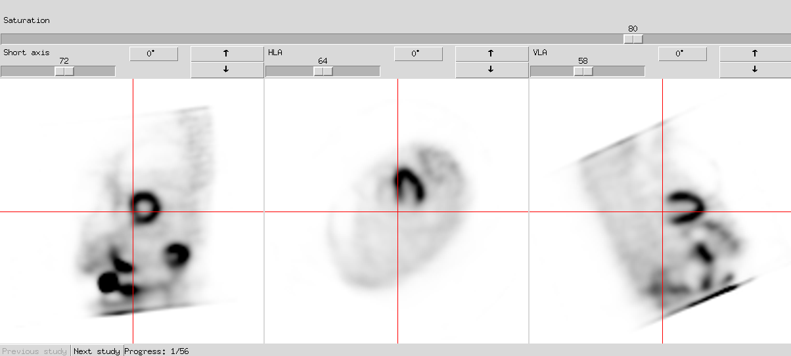
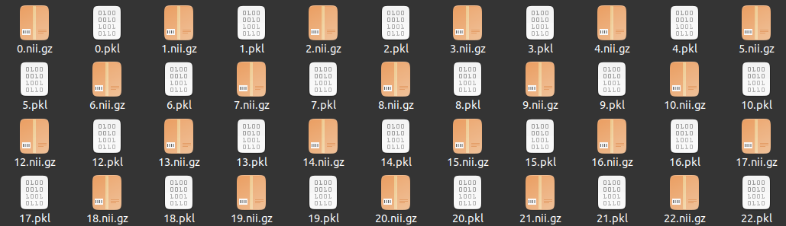
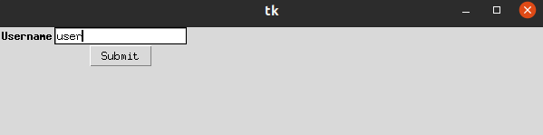
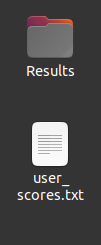
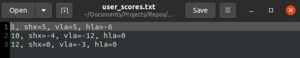

<!-- Improved compatibility of back to top link: See: https://github.com/othneildrew/Best-README-Template/pull/73 -->
<a id="readme-top"></a>
<!--
*** Thanks for checking out the Best-README-Template. If you have a suggestion
*** that would make this better, please fork the repo and create a pull request
*** or simply open an issue with the tag "enhancement".
*** Don't forget to give the project a star!
*** Thanks again! Now go create something AMAZING! :D
-->


<!-- PROJECT SHIELDS -->
<!--
*** I'm using markdown "reference style" links for readability.
*** Reference links are enclosed in brackets [ ] instead of parentheses ( ).
*** See the bottom of this document for the declaration of the reference variables
*** for contributors-url, forks-url, etc. This is an optional, concise syntax you may use.
*** https://www.markdownguide.org/basic-syntax/#reference-style-links
-->
[![Contributors][contributors-shield]][contributors-url]
[![Forks][forks-shield]][forks-url]
[![Stargazers][stars-shield]][stars-url]
[![Issues][issues-shield]][issues-url]
[![project_license][license-shield]][license-url]
[![LinkedIn][linkedin-shield]][linkedin-url]


<!-- PROJECT LOGO -->
<br />
<div align="center">
  <a href="https://github.com/EzequielVijande/OrientationGUI">
    
  </a>

<h3 align="center">Orientation GUI</h3>

  <p align="center">
    This project is a graphical user interface (GUI) for visualizing myocardial perfusion SPECT (MPS) images which have already been aligned along the long and short cardiac axes. The GUI has interactive buttons and scrollbars to allow changes in saturation level, cycling through the volume slices and rotating each view. The angles used for rotation are saved in a .txt file. 
    <br />
    <a href="https://github.com/EzequielVijande/OrientationGUI"><strong>Explore the docs »</strong></a>
    <br />
    <br />
    <a href="https://github.com/EzequielVijande/OrientationGUI">View Demo</a>
    &middot;
    <a href="https://github.com/EzequielVijande/OrientationGUI/issues/new?labels=bug&template=bug-report---.md">Report Bug</a>
    &middot;
    <a href="https://github.com/EzequielVijande/OrientationGUI/issues/new?labels=enhancement&template=feature-request---.md">Request Feature</a>
  </p>
</div>


<!-- TABLE OF CONTENTS -->
<details>
  <summary>Table of Contents</summary>
  <ol>
    <li>
      <a href="#about-the-project">About The Project</a>
      <ul>
        <li><a href="#built-with">Built With</a></li>
      </ul>
    </li>
    <li>
      <a href="#getting-started">Getting Started</a>
      <ul>
        <li><a href="#prerequisites">Prerequisites</a></li>
        <li><a href="#installation">Installation</a></li>
      </ul>
    </li>
    <li><a href="#usage">Usage</a></li>
    <li><a href="#roadmap">Roadmap</a></li>
    <li><a href="#contributing">Contributing</a></li>
    <li><a href="#license">License</a></li>
    <li><a href="#contact">Contact</a></li>
    <li><a href="#acknowledgments">Acknowledgments</a></li>
  </ol>
</details>


<!-- ABOUT THE PROJECT -->
## About The Project

This GUI was developed in order to study the inter-operator variability introduced by the cardiac reorientation step in the processing of MPS images.

<p align="right">(<a href="#readme-top">back to top</a>)</p>


### Built With

* [![Tkinter][Tkinter.py]][Tkinter-url]

<p align="right">(<a href="#readme-top">back to top</a>)</p>


<!-- GETTING STARTED -->
## Getting Started

This is an example of how you may give instructions on setting up your project locally.
To get a local copy up and running follow these simple example steps.

### Prerequisites

All required dependencies are listed in the "requirements.txt" file, installation can be performed via conda:
* conda
  ```sh
  conda install -n <env_name> requirements.txt
  ```

### Installation

1. Clone the repo
   ```sh
   git clone https://github.com/EzequielVijande/OrientationGUI.git
   ```

<p align="right">(<a href="#readme-top">back to top</a>)</p>


<!-- USAGE EXAMPLES -->
## Usage
SPECT images must be saved as NIfTI files in a directory on the current repository under the name "Results". This directory must also have a .pkl file for each .nii file, with each .pkl providing the information of the base, apex and right ventricle location. These locations must be saved as a dictionary with the keys "base", "apex" and "rv". Values for each key must be the centroid of the landmark in voxel units and float format.

An example of the contents in the Results dir is shown in the following image,

<a href="https://github.com/EzequielVijande/OrientationGUI/graphs/contributors">
  
</a>

After running the app the user will be prompted to input a user name.

<a href="https://github.com/EzequielVijande/OrientationGUI/graphs/contributors">
  
</a>

This user name is the same used for naming the .txt file which saves the rotation angles applied to each visualized study.

<a href="https://github.com/EzequielVijande/OrientationGUI/graphs/contributors">
  
</a>

Each row in this .txt has the name of the file first and the rotated angle for each view.

<a href="https://github.com/EzequielVijande/OrientationGUI/graphs/contributors">
  
</a>

<p align="right">(<a href="#readme-top">back to top</a>)</p>


<!-- CONTRIBUTING -->
## Contributing

Contributions are what make the open source community such an amazing place to learn, inspire, and create. Any contributions you make are **greatly appreciated**.

If you have a suggestion that would make this better, please fork the repo and create a pull request. You can also simply open an issue with the tag "enhancement".
Don't forget to give the project a star! Thanks again!

1. Fork the Project
2. Create your Feature Branch (`git checkout -b feature/AmazingFeature`)
3. Commit your Changes (`git commit -m 'Add some AmazingFeature'`)
4. Push to the Branch (`git push origin feature/AmazingFeature`)
5. Open a Pull Request

<p align="right">(<a href="#readme-top">back to top</a>)</p>

### Top contributors:

<a href="https://github.com/EzequielVijande/OrientationGUI/graphs/contributors">
  
</a>


<!-- LICENSE -->
## License

Distributed under the GPL-3.0 license. See `LICENSE.txt` for more information.

<p align="right">(<a href="#readme-top">back to top</a>)</p>


<!-- CONTACT -->
## Contact

Ezequiel Vijande -  ezequielvijande@gmail.com

Project Link: [https://github.com/EzequielVijande/OrientationGUI](https://github.com/EzequielVijande/OrientationGUI)

<p align="right">(<a href="#readme-top">back to top</a>)</p>


<!-- ACKNOWLEDGMENTS -->
## Acknowledgments

* [README template](https://github.com/othneildrew/Best-README-Template/tree/main?tab=readme-ov-file)

<p align="right">(<a href="#readme-top">back to top</a>)</p>


<!-- MARKDOWN LINKS & IMAGES -->
<!-- https://www.markdownguide.org/basic-syntax/#reference-style-links -->
[contributors-shield]: https://img.shields.io/github/contributors/EzequielVijande/OrientationGUI.svg?style=for-the-badge
[contributors-url]: https://github.com/EzequielVijande/OrientationGUI/graphs/contributors
[forks-shield]: https://img.shields.io/github/forks/EzequielVijande/OrientationGUI.svg?style=for-the-badge
[forks-url]: https://github.com/EzequielVijande/OrientationGUI/network/members
[stars-shield]: https://img.shields.io/github/stars/EzequielVijande/OrientationGUI.svg?style=for-the-badge
[stars-url]: https://github.com/EzequielVijande/OrientationGUI/stargazers
[issues-shield]: https://img.shields.io/github/issues/EzequielVijande/OrientationGUI.svg?style=for-the-badge
[issues-url]: https://github.com/EzequielVijande/OrientationGUI/issues
[license-shield]: https://img.shields.io/github/license/EzequielVijande/OrientationGUI.svg?style=for-the-badge
[license-url]: https://github.com/EzequielVijande/OrientationGUI/blob/master/LICENSE.txt
[linkedin-shield]: https://img.shields.io/badge/-LinkedIn-black.svg?style=for-the-badge&logo=linkedin&colorB=555
[linkedin-url]: https://linkedin.com/in/ezequiel-vijande
[product-screenshot]: images/screenshot.png
[Tkinter.py]: https://img.shields.io/badge/python-3670A0?style=for-the-badge&logo=python&logoColor=ffdd54
[Tkinter-url]: https://docs.python.org/3/library/tkinter.html
